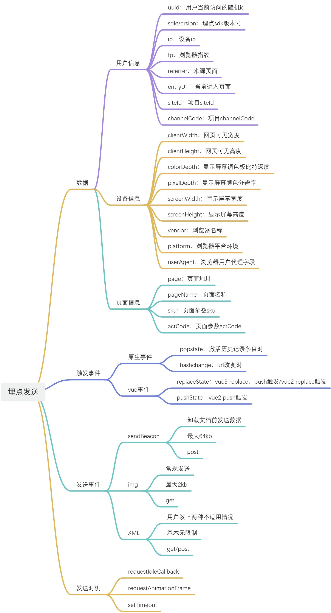

## 埋点是什么

埋点又称为事件追踪（Event Tracking），指的是针对用户行为或事件进行捕获、处理和发送的相关技术及其实施过程。用大白话说：就是通过技术手段“监听”用户在 APP、网站内的行为

## 埋点的作用

如果我们想要收集用户行为数据，就可以通过埋点来实现

- 比如想要了解一个用户在 APP 里面点击了哪些按钮，看了哪些页面，做了哪些事情等
- 再比如想要了解有多少人用过某些功能，使用的频率次数等

前端埋点和监控的出现，可以帮助开发者和产品运营人员，收集用户的行为数据，分析用户的行为习惯，实时监控应用的性能，发现和解决问题，处理系统故障。通过实施有效的埋点和监控策略，不断地进行产品优化，提出更好的营销策略，以提升用户体验和产品价值

## 流行的监控工具

- Sentry：一个开源的前端错误监控工具，可以捕获和报告 JavaScript 和前端框架的错误和异常。它提供详细的错误信息和堆栈跟踪，帮助开发人员快速定位和解决问题
- Google Analytics（谷歌分析）：非常流行的网站统计和分析工具，提供了丰富的功能，如用户行为分析、性能监控、事件追踪等
- Lighthouse：由 Google 提供的开源网站性能分析工具，可以评估页面的性能、可访问性、SEO 等方面
- WebPageTest：这是一个在线的网站性能测试工具，可以测试页面加载速度、首屏渲染时间等性能指标

## 设计埋点方案



## 代码实现

### 获取用户信息

```javascript
async function getBaseInfo() {
  const [ips, fp] = await Promise.all([getIPs(), getUserFingerprint()])

  return {
    fp,
    uuid: uuidv4(),
    sdkVersion: '0.0.1',
    ip: (ips as string[])[0],
    referrer: document.referrer,
    entryUrl: location.href
  }
}
```

- ips：通过公共方法获取
- fp：通过 @fingerprintjs/fingerprintjs 获取
- uuid：通过 uuid 获取

### 获取设备信息

```javascript
function getDeviceInfo() {
  const { clientWidth, clientHeight } = document.documentElement
  const { width, height, colorDepth, pixelDepth } = screen
  const { vendor, platform, userAgent } = navigator

  return { clientHeight, clientWidth, colorDepth, pixelDepth, vendor, platform, userAgent, screenWidth: width, screenHeight: height }
}
```

### 注册监听事件

```javascript
import { _globalVar } from '../utils/index'
import { setPageInfo } from './pageInfo'
import { storeData, sendData } from '../lib/index'

const EVENT_MAP = ['popstate', 'hashchange']
const SEND_EVENT_MAP = ['visibilitychange', 'pagehide']

export function initEvent() {
  initRouter()
  addMonitorEvent()
  addSendEvent()
}

export function addMonitorEvent() {
  EVENT_MAP.forEach(item => {
    window.addEventListener(
      item,
      () => {
        storeData.setPageInfo({ ...setPageInfo() })
        console.log('触发handler：event', storeData.getTracing())
      },
      false
    )
  })
}

export function addSendEvent() {
  SEND_EVENT_MAP.forEach(item => {
    window.addEventListener(
      item,
      () => {
        sendData()
        console.log('触发handler：sendData', storeData.getTracing())
        localStorage.setItem('a', '触发handler：sendData')
      },
      false
    )
  })
}

export function initRouter() {
  const { vueVersion } = storeData.getOptions()

  const originalReplaceState = history.replaceState
  history.replaceState = (...args) => {
    const from = {
      fromPage: location.href,
      fromPageName: document.title,
      stayTime: Date.now() - _globalVar.startTime
    }
    originalReplaceState.apply(history, args)
    _globalVar.startTime = Date.now()
    setTimeout(() => {
      storeData.setPageInfo({
        ...setPageInfo(),
        ...from
      })
      console.log('触发handler：replaceState', storeData.getTracing())
    })
  }
  if (vueVersion !== 3) {
    const originalPushState = history.pushState
    history.pushState = (...args) => {
      const from = {
        fromPage: location.href,
        fromPageName: document.title,
        stayTime: Date.now() - _globalVar.startTime
      }
      originalPushState.apply(history, args)
      _globalVar.startTime = Date.now()
      setTimeout(() => {
        storeData.setPageInfo({
          ...setPageInfo(),
          ...from
        })
        console.log('触发handler：pushState', storeData.getTracing())
      })
    }
  }
}
```

- vue2/3 的路由跳转底层实现不一致，vue2push 使用 pushState，所以需要在 vue2 版本路由跳转监听 pushState 的改动
- 由于 visibilitychange，pagehide 是拿不到页面跳转信息的，需要和 popstate，hashchange
- 事件触发向收集器推送数据，由收集器统一来管理发送操作
- 绑定 window 对象记录用户页面进入时间获取用户页面停留时间

### 数据储存器

```typescript
import { BaseInfo, Options, PageInfo } from '../types/index'
import { sendData } from '../lib/index'

interface Tracing {
  base: BaseInfo
  page: PageInfo
}

class StoreData {
  private static instance: StoreData
  private tracing = [] as Tracing[]
  private baseInfo = {} as BaseInfo
  private pageInfo = {} as PageInfo
  private options = {} as Options

  private constructor() {}

  private setTracing(tracing: Tracing) {
    this.tracing.push(tracing)
  }
  public static getInstance(): StoreData {
    if (!StoreData.instance) {
      StoreData.instance = new StoreData()
    }
    return StoreData.instance
  }

  public setBaseInfo(baseInfo: BaseInfo) {
    this.baseInfo = baseInfo
  }

  public setPageInfo(pageInfo: PageInfo) {
    this.pageInfo = pageInfo
    this.setTracing({ base: this.baseInfo, page: this.pageInfo })
    sendData()
  }

  public setOptions(options: Options) {
    this.options = options
  }

  public getTracing(): Tracing[] {
    return this.tracing
  }

  public getOptions(): Options {
    return this.options
  }

  public clearTracing() {
    this.tracing = []
  }
}

export const storeData: StoreData = StoreData.getInstance()
```

- 通过单例模式保证整个项目只有一个 StoreData 储存器
- 整个 tracing 设计成栈结构，添加一个埋点入栈，发送数据后进行出栈清空操作

### 发射器

```typescript
import { debounce, sendByBeacon, sendByImage, sendByXML, isObjectOverSizeLimit, nextIdle } from '../utils/index'
import { storeData } from '../lib/index'

function executeSend(data: any) {
  const { api } = storeData.getOptions()
  let sendType = 1
  if (window.navigator) {
    sendType = isObjectOverSizeLimit(data, 60) ? 3 : 1
  } else {
    sendType = isObjectOverSizeLimit(data, 2) ? 3 : 2
  }
  return new Promise(resolve => {
    switch (sendType) {
      case 1:
        resolve({ sendType: 'sendBeacon', success: sendByBeacon(api, data) })
        break
      case 2:
        sendByImage(api, data).then(() => {
          resolve({ sendType: 'image', success: true })
        })
        break
      case 3:
        sendByXML(api, data).then(() => {
          resolve({ sendType: 'xml', success: true })
        })
        break
    }
  })
}

export const sendData = debounce(() => {
  if (storeData.getTracing().length) {
    nextIdle(() => {
      executeSend({}).then(() => {
        console.log('已发送数据', storeData.getTracing())
        storeData.clearTracing()
        sendData()
      })
    })
  }
}, 2000)
```

- 智能设计当前可发送的方式，默认为 1，通过 api 兼容性查询，发送大小匹配方式 2，3
- 设计 nextIdle 方法为浏览器空闲时发送，发送完时间清空数据中心
