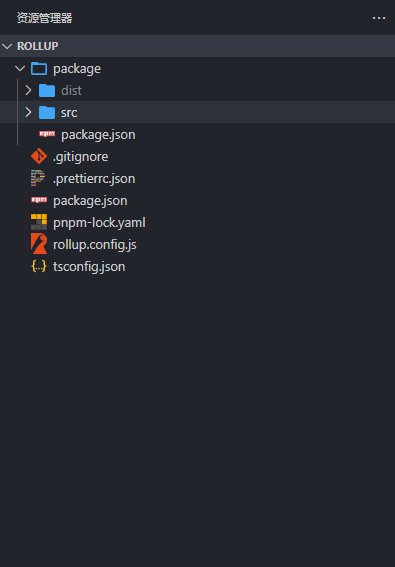
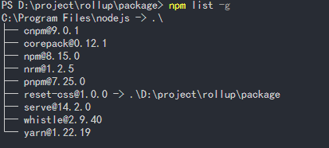
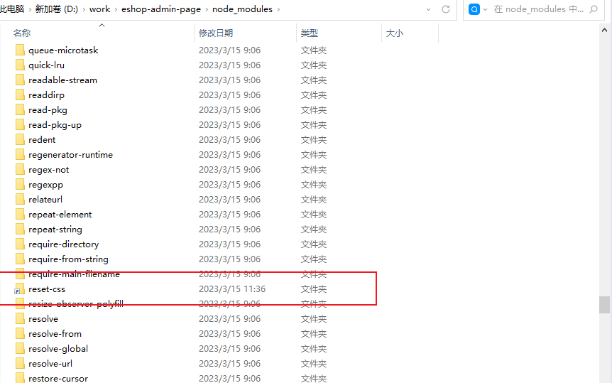

## 为什么要用 npm link

本地库包在开发或迭代后，不适合发布到线上进行调试，这会过程繁琐且会导致版本号膨胀

## npm link 工作原理

`npm link`的官方描述是： 将在全局文件夹中创建一个符号链接，该符号链接链接到执行命令的包
怎么理解这句话呢？
`npm link`的包将被挂载到`npm`全局依赖中
我们执行命令后，可以运行`npm list -g`，可以发现本地库包已经被安装到全局依赖中了
运行`npm config get prefix`，定位到`npm`全局依赖的文件夹中，我们可以清楚看到我们的库包已经被映射到全局依赖中了，如果你熟悉`pnpm`，那你应该很清楚，他们工作原理是一样的

## npm link 的使用

在本地库包开发目录



以 rollup 编译为例，我们使用 rollup 编译`reset-css`，编译出文件目录为 package/dist，我们发布的库包文件为 package 目录
那我们需要在 package 目录下输入

```bash
# path D:\project\rollup\package>

npm link
```

我们的本地库包会被添加到全局依赖中，我们可以输入`npm list -g`来验证结果



我们本地库包的开发包名为`reset-css`，我们可以看到`reset-css`已经被添加到全局依赖中了
在要使用本地库包的项目目录中

```bash
# path D:\work\eshop-admin-page>

npm link reset-css
```

就可以在项目中正常使用本地库包了，因为已经导入到我们项目中的`node_modules`
我们可以在`node_modules`验证这一点



reset-css 已经被正常的导入到项目中来了，我们可以发现，reset-css 是一个映射关系，我们在本地库包进行的更改，都会同步到我们要使用的目录中来，而不需要每次都重新建立映射关系

## 删除 npm link 的链接

开发完本地库包后，我们需要删除 npm link 的链接
解除模块的全局链接

```bash
npm unlink reset-css -g
```

这样本地调试库包的流程就完成了

## pnpm

### pnpm link --global

从执行此命令的路径或通过 dir 选项指定的文件夹，链接 package 到全局的 node_modules 中，所以使其可以被另一个使用 pnpm link --global pkg 的 package 引用。

### pnpm link --global pkg

将指定的包（pkg）从全局 node_modules 链接到 package 的 node_modules，从该 package 中执行或通过 --dir 选项指定。

## 常见问题


vite默认访问此目录列表之外未从允许的文件导入的文件将导致[403](https://vitejs.dev/config/server-options.html#server-fs-allow)，我们设置接受用于指定自定义工作区根目录的路径

```javascript
export default defineConfig({
  server: {
    fs: {
      // Allow serving files from one level up to the project root
      allow: ['..']
    }
  }
})
```
